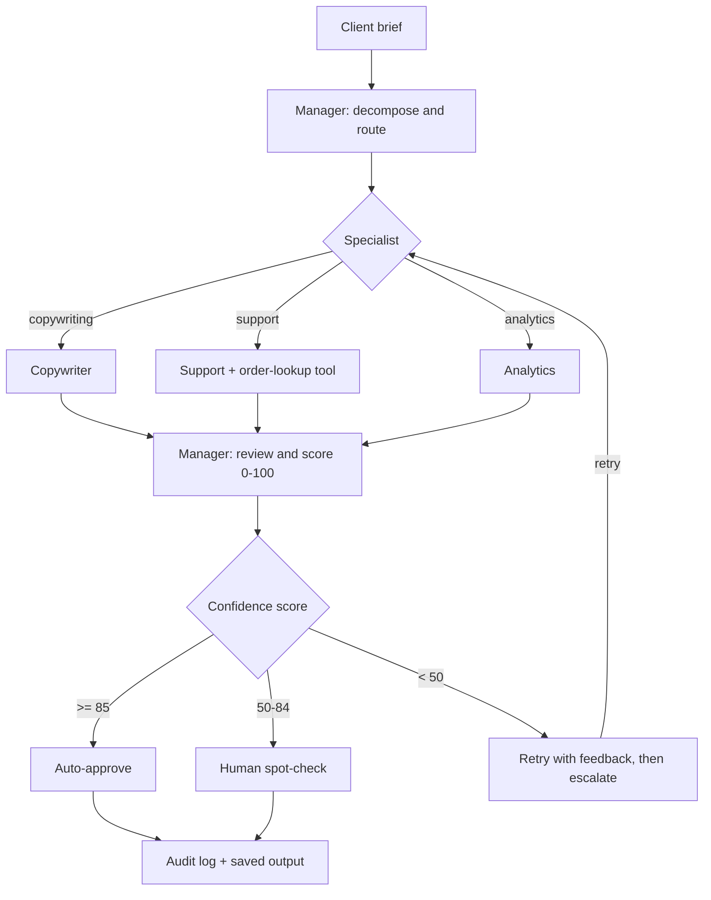

[README.md](https://github.com/user-attachments/files/28763671/README.md)
# AgentForce

A multi-agent LLM system that turns a single brief into reviewed, on-brand output — built with [LangGraph](https://github.com/langchain-ai/langgraph) and a local open-weight model via [Ollama](https://ollama.com). A manager agent decomposes each request, routes the sub-tasks to specialist agents, and reviews the results through quality gates before anything is returned.

The focus of this project is **reliability**: every output is scored, low-scoring work is automatically retried, risky work is escalated to a human, and every step is logged.

---

## Overview

AgentForce coordinates four specialist agents as a small "assembly line" rather than a free-flowing conversation. Work moves in one direction through review gates, which prevents a mistake by one agent from compounding through the rest of the pipeline.

- **Manager** — decomposes a brief into sub-tasks, routes each to the right specialist, then reviews and scores the result.
- **Copywriter** — writes product descriptions, ad copy, and email drafts.
- **Support** — drafts customer-support replies and can look up order details through a tool.
- **Analytics** — analyses data and produces summary reports.

All agents currently run on a single local model (`qwen3:8b`), each configured with a different role and system prompt. The architecture is backend-agnostic, so individual tasks can be routed to other models if desired.

---

## Architecture



Every agent-to-agent handoff uses a **structured schema** (defined in `schemas/state.py`) rather than free-text passing, so information cannot be garbled between stages.

---

## Key features

- **Confidence-based quality gating** — each output is scored 0–100 and routed automatically: auto-approve at ≥ 85, sample-review at 50–84, retry or escalate below 50.
- **Automated retry / self-correction** — a low-scoring output is sent back to the specialist with specific feedback (up to 2 attempts before human escalation). In testing, a poor first draft scored 20, then recovered to 82 after one feedback-driven retry.
- **Risk-based human-in-the-loop** — escalation is keyed to how damaging a mistake would be (blast radius), whether it can be undone (reversibility), and whether the task is novel or routine.
- **End-to-end audit logging** — every handoff is recorded (timestamp, source agent, target agent, action) for traceability and debugging.
- **Structured handoffs** — typed schemas for all inter-agent communication (`schemas/state.py`).
- **Multi-tenant brand configs** — the same brief produces different, on-brand output per client. Two demo brands are included: *Terra & Clay* (warm, artisanal) and *VOLT* (bold, technical), in `config/brand_configs/`.
- **Tool use** — the Support agent detects an order number in a message and calls `tools/order_lookup.py` to populate real order details (name, items, tracking) instead of placeholders.
- **Web interface** — a [Streamlit](https://streamlit.io) portal (`portal/app.py`) to submit briefs, stream a run live, and view the confidence score, review status, output, and audit-log timeline.

---

## Project structure

```
agentforce/
├── graph.py              # Wires the agents into the one-way (DAG) flow
├── run.py                # Run a task from the command line
├── agents/               # The four agents (manager, copywriter, support, analytics)
├── config/               # Brand-config loader + demo brand definitions
│   └── brand_configs/    # terra_and_clay.json, volt.json
├── data/                 # Sample order data (mock) for the Support agent
├── portal/               # Streamlit web interface (app.py)
├── schemas/              # Structured state / handoff schemas
├── tools/                # Order-lookup tool
└── utils/                # Output + audit-log saving
```

---

## Getting started

### Prerequisites

- Python 3.10+
- [Ollama](https://ollama.com) installed and running
- The model pulled locally:
  ```bash
  ollama pull qwen3:8b
  ```

### Install

```bash
git clone https://github.com/juntze-sim/agentforce-public.git
cd agentforce-public
pip install -r requirements.txt
```

### Run

From the command line:

```bash
python run.py
```

Or launch the web portal:

```bash
streamlit run portal/app.py
```

### Run with Docker

Make sure Ollama is reachable on all interfaces:

```bash
OLLAMA_HOST=0.0.0.0 ollama serve
```

Build and run:

```bash
docker build -t agentforce .
docker run --rm agentforce
```

The container connects to Ollama on the host via `host.docker.internal:11434`. Override the model or URL with `-e`:

```bash
docker run --rm -e OLLAMA_MODEL=llama3 agentforce
```

---

## How a request flows

1. A brief arrives (e.g. *"write 3 product descriptions for our new candle line"*).
2. The **Manager** breaks it into sub-tasks and labels each as copywriting, support, or analytics.
3. Each sub-task is routed to the matching **specialist**, which produces the work using the active brand's voice.
4. The **Manager** reviews the result against four criteria — complete, accurate, actionable, on-brand — and assigns a confidence score.
5. The score decides the outcome: ship, spot-check, or retry/escalate.
6. The finished output and a full audit log are saved.

A single agent step takes roughly 10–25 seconds on local hardware (Apple Silicon, M2); a full decompose → specialist → review run takes about 30–75 seconds.

---

## Project status

This is a **working prototype** that demonstrates the full pipeline end to end, tested on sample briefs. It runs locally and in Docker. Possible next steps include a cloud backend for scale and a document-ingestion / retrieval layer.

---

## Tech stack

Python · LangGraph · Ollama (`qwen3:8b`) · Streamlit · structured-state schemas · DAG orchestration with review gates
